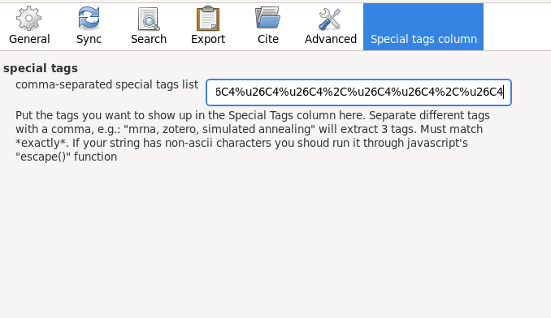

# Zotero Special Tags column

This Zotero plugin lets you define a list of special tags that you want to filter out for displaying in a separate column called "Special Tags". With specially crafted tags you can use it to display tailored information in a column in an at-a-glance style. See below for an example.

# Installation

Download a release from the [releases page](https://github.com/whacked/zotero-special-tags-column/releases), then in Zotero, go to Tools -> Add-Ons, then install from file.

# Example usage

let's say you want to use 🐶 and ⛄ as column markers.

```javascript
escape("🐶🐶🐶🐶🐶,🐶🐶🐶🐶,🐶🐶🐶,🐶🐶,🐶,⛄⛄⛄⛄⛄,⛄⛄⛄⛄,⛄⛄⛄,⛄⛄,⛄")
> %uD83D%uDC36%uD83D%uDC36%uD83D%uDC36%uD83D%uDC36%uD83D%uDC36%2C%uD83D%uDC36%uD83D%uDC36%uD83D%uDC36%uD83D%uDC36%2C%uD83D%uDC36%uD83D%uDC36%uD83D%uDC36%2C%uD83D%uDC36%uD83D%uDC36%2C%uD83D%uDC36%2C%u26C4%u26C4%u26C4%u26C4%u26C4%2C%u26C4%u26C4%u26C4%u26C4%2C%u26C4%u26C4%u26C4%2C%u26C4%u26C4%2C%u26C4
```

paste that into the text field



restart zotero (necessary at the moment)

your special tags should show up in the Special Tags column for entries that have matches


# Development

back up your $HOME/Zotero folder if you have one. Zotero will write to it by default. (It's possible to override the location in prefs.js, but this file is created by Zotero).

if you have a [nix environment](https://nixos.org/download.html) available, clone this repository and run `nix-shell`, which should give you a ready environment that runs a bare Zotero installation in a temporary directory, with the plugin pushed into the prefs.js file. For iteration, run `rzt` from the `nix-shell` to reload the entire plugin and start the debug instance with the javascript console.

if you don't have a nix-environment, see `initialize-zotero-plugin` in [shell.nix](shell.nix) where the setup loop happens. Everything else is vanilla and trial and error.

# References
    
this plugin is made possible by prior work from:
    
- https://github.com/dcartertod/zotero-plugins
- https://retorque.re/zotero-better-bibtex/

thank you!
