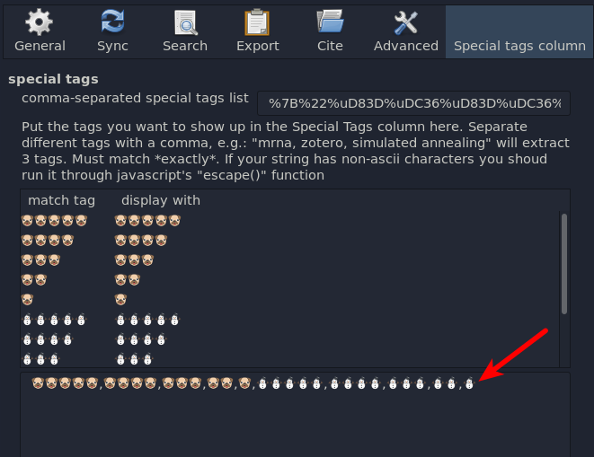
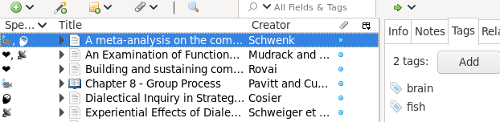
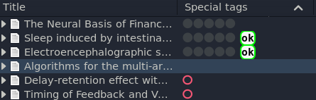

# Zotero Special Tags column

This Zotero plugin lets you define a list of special tags that you want to filter out for displaying in a separate column called "Special Tags". With specially crafted tags you can use it to display tailored information in a column in an at-a-glance style. See below for an example.

# Installation

Download a release from the [releases page](https://github.com/whacked/zotero-special-tags-column/releases), then in Zotero, go to Tools -> Add-Ons, then install from file.

# Example usage

## designating special tags

let's say you want to use 🐶 and ⛄ as column markers.

```
🐶🐶🐶🐶🐶,🐶🐶🐶🐶,🐶🐶🐶,🐶🐶,🐶,⛄⛄⛄⛄⛄,⛄⛄⛄⛄,⛄⛄⛄,⛄⛄,⛄
```

paste that into the bottom text field



The changes should be updated when you close the settings window. **However**, they do not get refreshed Zotero's main window automatically. To refresh, you can switch to a different Zotero folder, and switch back.

your special tags should show up in the Special Tags column for entries that have matches


## mapping existing tags to a different look

if you don't want to add a new kind of tag, you can map an existing tag to display differently in the Special Tags column by using a JSON value as the input. For example:

```javascript
{
    "brain": "🧠",
    "heart": "❤",
    "radio": "📡",
    "fish": "🐟"
}
```

**NOTE: make sure you input valid JSON into the text field**



## styling the mapped tags (Zotero 6+)

you can apply custom styles by passing a CSS object in the JSON string. Example:

```javascript
{
    "5 circles": "⚫⚫⚫⚫⚫",
    "red ring": "⭕",
    "ok": {"innerText":"ok","style":{"border-radius":"0.5em","border":"2px solid #0F0","background":"#FFF","color":"#000","font-weight":"bold"}}
}
```

leads to something like this



# Development

back up your $HOME/Zotero folder if you have one. Zotero will write to it by default. (It's possible to override the location in prefs.js, but this file is created by Zotero).

if you have a [nix environment](https://nixos.org/download.html) available, clone this repository and run `nix-shell`, which should give you a ready environment that runs a bare Zotero installation in a temporary directory, with the plugin pushed into the prefs.js file. For iteration, run `rzt` from the `nix-shell` to reload the entire plugin and start the debug instance with the javascript console.

when you are done, run `pack` to produce the installable xpi file.

if you don't have a nix-environment, see `initialize-zotero-plugin` in [shell.nix](shell.nix) where the setup loop happens. Everything else is vanilla and trial and error.

# References
    
this plugin is made possible by prior work from:
    
- https://github.com/dcartertod/zotero-plugins
- https://retorque.re/zotero-better-bibtex/

thank you!
